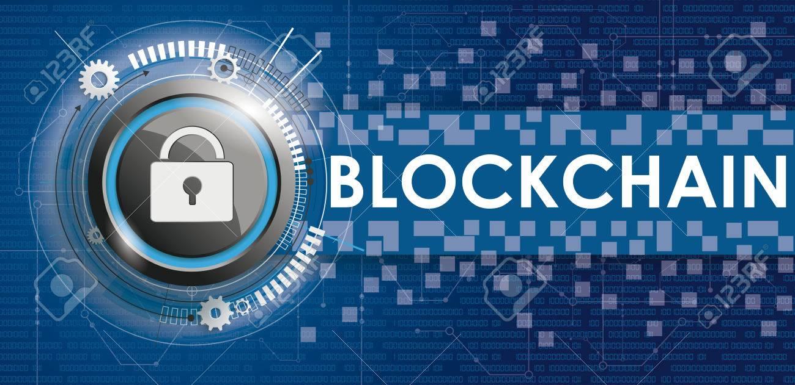
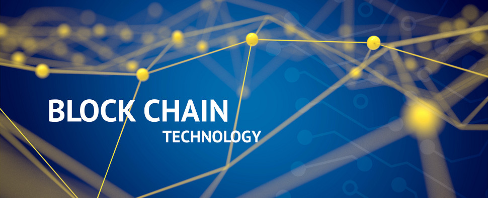

<!-- Banner Image -->

<h1>👋 Welcome to My Profile</h1>
<h2><b>Marwan Almoghrabi</b></h2>
<h3>💠 Blockchain Developer | Tech Entrepreneur</h3>

Building the infrastructure for the decentralized future — one block at a time.

<!-- Social Links -->

  
  
  

<!-- Profile Views -->

---

## 👨‍💻 About Me

I am a **Blockchain Developer** specializing in designing and building **decentralized applications (dApps)** and **blockchain infrastructure**.  
My focus includes **smart contracts**, **node operations**, and **decentralized hosting** using technologies like **Cosmos**, **Akash Network**, and **IBC Protocol**.  

💡 **Belief:** Blockchain is revolutionizing how we handle data, trust, and ownership — and I’m helping build that foundation.

---

## 🚀 Vision: Blockchain Data Center in the Middle East

I am the founder and lead of an ambitious project to establish the **first specialized Blockchain Data Center** in **Jordan**, serving as a hub for blockchain infrastructure across the Middle East.  

- **Current Stage:** One **high-performance server** is already up and running — the first step in our decentralized data center journey.  
- **Goal:** To provide **blockchain hosting**, **node deployment**, and **Infrastructure-as-a-Service (IaaS)** for Web3 startups and developers.

  

---

## 🛠️ Skills & Technologies

### 🧩 Programming Languages & Tools

  
  
  
  
  

### ⚙️ Frameworks & Libraries

  
  
  
  
  

### 🌐 Concepts & Infrastructure

  
  
  
  
  
  

---

## 🏆 GitHub Trophies

  

---

## 📊 GitHub Stats

  
  

---

## 📫 Get in Touch

  💬 Always open to collaboration, innovation, and discussions about the future of blockchain.  
   
  <a href="mailto:marwan.almoghrabi@gmail.com">
    <strong>📧 MarwanAlmoghrabi@icloud.com</strong>
  </a>

---

  
    
  <b>“Empowering the Middle East through Decentralized Infrastructure.”</b>

